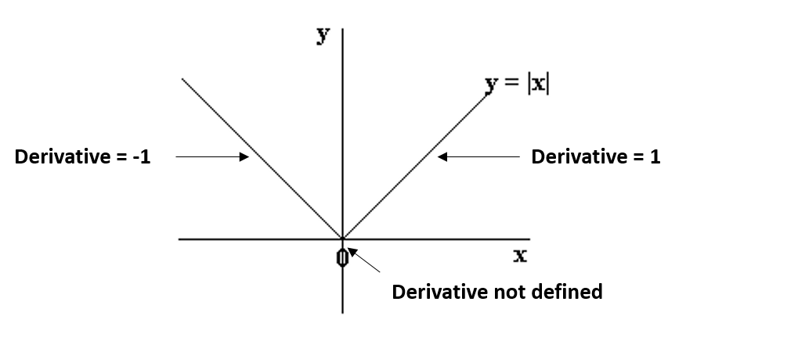

# Outline

* Logistic Regression with Sparse Regularization

* Multi-Class Logistic

# Logistic Regression

1. Load the binary dataset
    * $X \in \mathbb{R}^{n \times d}$, $y \in \{\pm 1\}^n$

2. Standardize the columns of $X$
    * Each column in $X$ is standardized using z-score scaling
    * $X^j = \frac{(X^j - \mu_j)}{\sigma_j}$, $\mu_j = np.sqrt{\frac{\sum_{i=1}^n X_i^j}{n}}$,  $\sigma_j = \frac{\sum_{i=1}^n (X_i^j - \mu_j)^2}{n}$
    * Each column has mean 0 and variance 1 but different ranges

3. Add bias (add a column of all ones to $X$)

4. Train logistic regression on $X$ and $y$


# Trained Logistic Regression

1. Standardize the columns of $X_\text{validate}$ using $\mu_j$ and $\sigma_j$
2. Add bias (add a column of all ones to $X$)
3. Compute validation error on $X_{\text{valid}}$ and $y_{\text{valid}}$
4. Compute the number of non-zeros for $w$


# Fit logistic Regression

* Initialize $w \in \{0\}^d$
* Check gradient using the complex step method (it's given)
    * more accurate than finite differencing

* Set up the objective function and the gradient funObj (func, grad)
    * funObj[0] = $f(w) = \sum_{i=1}^n \log{(1 + \exp(-y_i w^T x_i))}$
    * funObj[1] = $\nabla f(w) = ?$ (Derive)

* Run findMin
    * Update $w^t$ for **maxEvals** iterations
    * $w^{t+1} = w^t - \alpha \nabla f(w^t)$
    * Uses line search to determine $\alpha$ that ensures
        * $f(w^{t+1}) < f(w^t)$
        * $w^{t+1} = w^t - \alpha \nabla f(w^t)$

# Evaluate logistic Regression

* Compute the classification error on the validation set

* Compute the number of non-zeros on $w$

# Logistic Regression L2

* Logistic regression $$f(w) = \sum_{i=1}^n \log{(1 + \exp(-y_i w^T x_i))}$$

* L2 Regularized Logistic Regression
* funObj[0] = $$f(w) = \sum_{i=1}^n \log{(1 + \exp(-y_i w^T x_i))} + \frac{\lambda}{2}||w||_2^2$$
* funObj[1] = $\nabla f(w) = ?$

# Logistic Regression L1

* $f(w) = \sum_{i=1}^n \log{(1 + \exp(-y_i w^T x_i))} + \lambda ||w||_1$
* $||w||_1$ is not differentiable at the origin




# Logistic Regression L1
* $f(w) = \sum_{i=1}^n \log{(1 + \exp(-y_i w^T x_i))} + \lambda ||w||_1$
* $||w||_1$ is not differentiable at the origin

* Define funObj the same way as Logistic regression
    * funObj[0] = $f(w) = \sum_{i=1}^n \log{(1 + \exp(-y_i w^T x_i))}$
    * funObj[1] = $\nabla f(w) = ?$

* Use findMinL1 instead of findMin to optimize the objective function
* findMinL1 uses proximal gradient to take care of the L1 norm

# Logistic Regression L1
* You should expect some zero elements in $w$ the parameter vector
* Distance to minimum is not negligble

\includegraphics[width=0.8\textwidth]{images/l11.png}

# Logistic Regression L1
* Minimize $L_1(w) = \sum_i |w_i|_1$ 
\includegraphics[width=0.8\textwidth]{images/l11.png}
* Minimize $L_2(w) = \frac{1}{2}\sum_i w_i^2$ 
\includegraphics[width=0.8\textwidth]{images/l12.png}


# Logistic Regression L1
* Minimize $L_1(w) = \sum_i |w_i|_1$ 
\includegraphics[width=0.8\textwidth]{images/l13.png}

# Logistic Regression L1
* Minimize $L_2(w) = \frac{1}{2}\sum_i w_i^2$ 
\includegraphics[width=0.8\textwidth]{images/l14.png}


# Logistic Regression L0
* Objective:
$$f(w) = \sum_{i=1}^n \log{(1 + \exp(-y_i w^T x_i))} + \lambda ||w||_0$$
* Class inheritance (Demonstrate)
* Always include the bias
* Select best feature using forward selection
* Note that adding any feature adds the same penalty $\lambda$
* Stop when the decrease in the model error is less than the added penalty


# leastSquaresClassifier
* Classify a multi-class dataset using one-vs-all method
* Consider a dataset of 3 samples


* How many linear models ?


# leastSquaresClassifier
* Classify a multi-class dataset using one-vs-all method
* Consider a dataset of 3 samples

\includegraphics[width=0.6\textwidth]{images/multiclass.png}


# leastSquaresClassifier
* To make a prediction:
    * Compute $X_iW^k$ for each class $k$ and take the largest.

```python
def predict(self, X):
    yhat = np.dot(X, self.W)

    return np.argmax(yhat, axis=1)

```

# logisticRegression
* Instead of leastSquares use logisticRegression
* $f(w) = \sum_{i=1}^n \log{(1 + \exp(-y_i w^T x_i))}$

```python
for i in range(self.n_classes):
    ytmp = y.copy().astype(float)
    ytmp[y==i] = 1
    ytmp[y!=i] = -1

    self.W[:, i] = np.linalg.lstsq(np.dot(X.T, X), 
                                   np.dot(X.T, ytmp)
```

# Multinomial logistic regression - SoftmaxClassifier

* Uses one classifier to classify points w.r.t all classes

* Learns a global distribution  
    * Probability that a data point belongs to each class

\includegraphics[width=0.6\textwidth]{images/softmax.png}

# Multinomial logistic regression - SoftmaxClassifier

* Same as with the other objective functions
    1. define funObj (func, grad)
    2. use findMin to minimize the function

* Set up the objective function and the gradient funObj (func, grad)
    * funObj[0] = $$f(W) = \sum_{i=1}^n \left[-w_{y_i}^Tx_i + \log\left(\sum_{c' = 1}^k \exp(w_{c'}^Tx_i)\right)\right].$$
    * funObj[1] = $\nabla f(w) = ?$ 

* Compute validation error


    