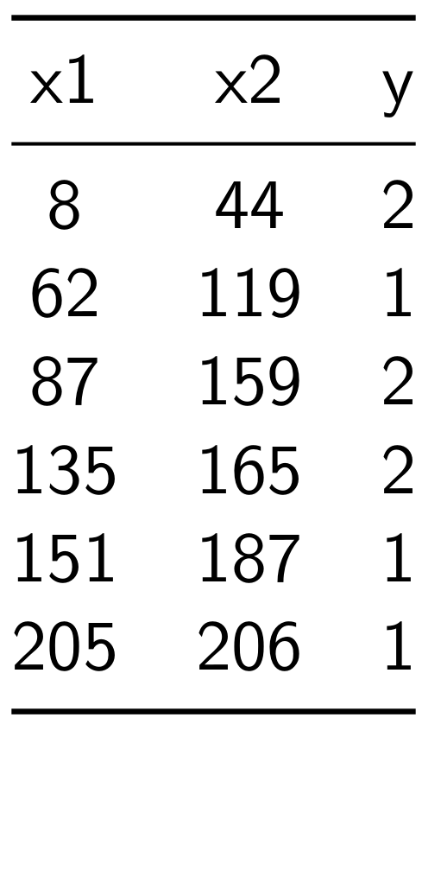
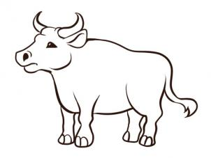

# Outline

* Decision Stump
* Decision Trees
* Random Forest


# Decision Stump 

* **Idea** to determine the feature and the split threshold that maximizes a certain score
    - Classification score
    ```python
    # Compute classification score
    score = np.sum(y_pred == y)
    ```
    - Information gain
    ```python
    # Compute information gain
    entropyTotal = entropy(y)
    p_sat = sat_set.shape[0] / float(N)
    p_not = 1. - p_sat
    H_sat = entropy(sat_set)
    H_not = entropy(not_set)
    score = (entropyTotal - p_sat * H_sat -
                p_not * H_not)
    ```


# Decision Stump

* Consider this dataset of 6 samples and 2 features and with target values $\in \{1,2\}$

| x1      | x2      | y |
|:---------:|:---------:|:---------:|
|   8   | 44  | 2
|  62  |   119 | 1
|   87  | 159  | 2
| 135  |   165  |2
|  151  |  187  |1
|  205 |  206  |1

* Demonstrate classification scores for several splits


# Decision Stump

* Split s.t. $y =1$ if $x1 > 8$ and $y=2$ otherwise

 \begin{center} 
 \includegraphics[width=0.23\textwidth]{images/table.png}  \;\;\;
 \includegraphics[width=0.7\textwidth]{images/0_8_split.pdf} 
 \end{center}


* Classification Score =  4

# Decision Stump


* Split s.t. $y =1$ if $x1 > 62$ and $y=2$ otherwise


 \begin{center} 
 \includegraphics[width=0.23\textwidth]{images/table.png}  \;\;\;
 \includegraphics[width=0.7\textwidth]{images/0_62_split.pdf} 
 \end{center}


* Classification Score =  3

# Decision Stump

* Split s.t. $y =1$ if $x1 > 135$ and $y=2$ otherwise

 \begin{center} 
 \includegraphics[width=0.23\textwidth]{images/table.png}  \;\;\;
 \includegraphics[width=0.7\textwidth]{images/0_135_split.pdf} 
 \end{center}


* Classification Score =  5

# Decision Stump

* Split s.t. $y =1$ if $x2 > 119$ and $y=2$ otherwise

 \begin{center} 
 \includegraphics[width=0.23\textwidth]{images/table.png}  \;\;\;
 \includegraphics[width=0.7\textwidth]{images/1_119_split.pdf} 
 \end{center}


* Classification Score =  3


# Decision Stump


* Split s.t. $y =1$ if $x2 > 187$ and $y=2$ otherwise


<!-- 
{ width=25% } \ { width=65% }
 -->

 \begin{center} 
 \includegraphics[width=0.23\textwidth]{images/table.png}  \;\;\;
 \includegraphics[width=0.7\textwidth]{images/1_187_split.pdf} 
 \end{center}

* Classification Score =  4

# Decision Stump - best split

* Split s.t. $y =1$ if $x1 > 135$ and $y=2$ otherwise

 \begin{center} 
 \includegraphics[width=0.23\textwidth]{images/table.png}  \;\;\;
 \includegraphics[width=0.7\textwidth]{images/0_135_split.pdf} 
 \end{center}

* Classification Score =  5


# Decision Tree

* A decision stump is a decision tree with depth 1

 \begin{center} 
 \includegraphics[width=0.6\textwidth]{images/best_ds.pdf}
 \includegraphics[width=0.5\textwidth]{images/best_dstree.pdf} 
 \end{center}


# Decision Tree
* A decision tree with depth 2

 \begin{center} 
 \includegraphics[width=0.6\textwidth]{images/best_ds_2.pdf}
 \includegraphics[width=0.5\textwidth]{images/best_dstree_2.pdf} 
 \end{center}


# Decision Tree

* A decision stump is a decisiont tree with depth 1


 \begin{center} 
 \includegraphics[width=0.6\textwidth]{images/best_ds_3.pdf}
 \includegraphics[width=0.5\textwidth]{images/best_dstree_3.pdf} 
 \end{center}


# Random Forest - Ensemble learning

1. Train more than one decision tree on different subsets of the dataset
2. Given a test sample, aggregate the decision tree predictions:
    *  then take their mean, max, median, etc.


| x1      | x2      | y |
|:---------:|:---------:|:---------:|
|   8   | 44  | 2
|  62  |   119 | 1
|   87  | 159  | 2
| 135  |   165  |2
|  151  |  187  |1
|  205 |  206  |1


* For example, 
    * train first decision tree on samples 1 and 2
    * train second decision tree on samples 2, 3, and 4
    * train third decision tree on samples 4,5, and 6


# Ensemble learning - example 1

* On a farmer's fair, 800 people volunteered to estimate the **weight** of an ox

* Galton reported 1,197 Ib which is the average of the crowd's answers
    * The true value was 1,198 lbs


* Some people would overshoot or undershoot the ox's weight estimate
    * The mean helps in averaging out the errors due to overestimates and underestimates 

*  If measurement errors are uncorrelated
    * wrong perceptions get averaged out

{width=35%}


# Ensemble learning - example 2

* Predict coordinate of a GPS device 


 \begin{center} 
 \includegraphics[width=0.9\textwidth]{images/1.pdf} 
 \end{center}


# Ensemble learning - example 2

* Predict coordinate of a GPS device using the average of 2 model predictions


 \begin{center} 
 \includegraphics[width=0.9\textwidth]{images/2.pdf} 
 \end{center}

# Ensemble learning - example 2

* Predict coordinate of a GPS device using the average of 4 model predictions


 \begin{center} 
 \includegraphics[width=0.9\textwidth]{images/3.pdf} 
 \end{center}


# Ensemble learning - Intuition

* Say we are trying to predict the health of a patient

 \begin{center} 
 \includegraphics[width=0.45\textwidth]{images/f1.pdf} 
 \end{center}


* Important Features (just an example): 
     * **f3** is blood pressure 
     * **f4** is sugar level

* Noisy Features (just an example): 
     * **f1** is the height of your backyard tree
     * **f2** is the number of appliances you have


# Ensemble learning - Health prediction

* The models highlight which features are thought to be **important** for predicting health

\begin{figure}
 \begin{center} 
 \includegraphics[width=0.45\textwidth]{images/f2.pdf} 
 \caption{First model (Red)}
 \end{center}
 \end{figure}


* Important Features (just an example): 
     * **f3** is blood pressure 
     * **f4** is sugar level

* Noisy Features (just an example): 
     * **f1** is the height of your backyard tree
     * **f2** is the number of appliances you have


# Ensemble learning - Health prediction

* The models highlight which features are thought to be **important** for predicting health

\begin{figure}
 \begin{center} 
 \includegraphics[width=0.45\textwidth]{images/f3.pdf} 
 \caption{First model (Red) - Second model (Green)}
 \end{center}
 \end{figure}


* Important Features (just an example): 
     * **f3** is blood pressure 
     * **f4** is sugar level

* Noisy Features (just an example): 
     * **f1** is the height of your backyard tree
     * **f2** is the number of appliances you have

# Ensemble learning - Health prediction

* The models highlight which features are thought to be **important** for predicting health

\begin{figure}
 \begin{center} 
 \includegraphics[width=0.45\textwidth]{images/f4.pdf} 
 \caption{First model (Red) - Second model (Green) - \\ Third model (Yellow)}
 \end{center}
 \end{figure}


* Important Features (just an example): 
     * **f3** is blood pressure 
     * **f4** is sugar level

* Noisy Features (just an example): 
     * **f1** is the height of your backyard tree
     * **f2** is the number of appliances you have


# Ensemble learning - Health prediction

* The models highlight which features are thought to be **important** for predicting health

\begin{figure}
 \begin{center} 
 \includegraphics[width=0.45\textwidth]{images/f4.pdf} 
 \caption{First model (Red) - Second model (Green) - \\ Third model (Yellow)}
 \end{center}
 \end{figure}

\begin{figure}
 \begin{center} 
 \includegraphics[width=0.45\textwidth]{images/f5.pdf} 
 \caption{Models' intersection on what features are important}
 \end{center}
 \end{figure}


# Ensemble learning - why does it work ?


* Central limit theorem - as the number of guesses goes to infinity, you approach a normal distribution
      * The more samples and guesses you get the more likely their mean is the true value


 \begin{center} 
 \includegraphics[width=0.45\textwidth]{images/normal.pdf} 
 \end{center}


* The probability that a trained model predicts a value that is two standard deviations away from the true value might be low 

* But your models are as good as your data
    * Still, it is the most popular technique to boost prediction scores in data science competitions


# Random Forests

* Train a decision tree on different subsets of the dataset

* Consider the following trained decision trees


\begin{figure}[ht]
 \begin{center} 
  \includegraphics[width=0.6\textwidth]{images/ds_sub1_all_1.pdf} 
 \includegraphics[width=0.45\textwidth]{images/ds_sub1_1.pdf}
   \caption{Decision Tree 1 - samples \{1, 2\}}
 \end{center}
\end{figure}

# Random Forests

* Train a decision tree on different subsets of the dataset

* Consider the following trained decision trees

\begin{figure}[ht]
 \begin{center} 
  \includegraphics[width=0.6\textwidth]{images/ds_sub2_all_1.pdf} 
 \includegraphics[width=0.45\textwidth]{images/ds_sub2_1.pdf}
  \caption{Decision Tree 2 - samples \{2, 3, 4, 5\}}
 \end{center}
\end{figure}

# Random Forests

* Train a decision tree on different subsets of the dataset

* Consider the following trained decision trees
\begin{figure}[ht]
 \begin{center} 
  \includegraphics[width=0.6\textwidth]{images/ds_sub3_all_1.pdf} 
 \includegraphics[width=0.45\textwidth]{images/ds_sub3_1.pdf}
 \caption{Decision Tree 3 - samples \{4,5,6\}}
 \end{center}
\end{figure}

# Random Forests - 3 decision trees
\begin{figure}[ht]
 \begin{center} 
   \includegraphics[width=0.5\textwidth]{images/ds_sub1_all_1.pdf} 
   \includegraphics[width=0.5\textwidth]{images/ds_sub2_all_1.pdf} 
 \end{center}
\end{figure}

 \begin{center} 
  \includegraphics[width=0.5\textwidth]{images/ds_sub3_all_1.pdf} 
 \end{center}
 
# What is the result of taking the maximum of the 3 decision model predictions ?
\begin{figure}[ht]
 \begin{center} 
   \includegraphics[width=0.5\textwidth]{images/ds_sub1_all_1.pdf} 
   \includegraphics[width=0.5\textwidth]{images/ds_sub2_all_1.pdf} 
 \end{center}
\end{figure}

 \begin{center} 
  \includegraphics[width=0.45\textwidth]{images/ds_sub3_all_1.pdf} 
 \end{center}
 

# Random Forests - 3 decision trees
* Result of taking the maximum of the 3 decision model predictions
\begin{figure}[ht]
 \begin{center} 
   \includegraphics[width=0.9\textwidth]{images/forest_1.pdf} 
 \end{center}
\end{figure}


# Conclusion
* Decision stump
    * Find the best split value (or threshold) for the best split variable (or feature)
    * The best split is one that maximizes a certain score, such as classification score
* Decision Tree
    * A decision tree is a tree of decision stumps 
    * Stop splitting when depth is reached or the score is maximized (classification error = 0)

* Random Forests
    * Train several decision trees on different subsets of the dataset
    * Take and process the ensemble of predictions to predict the target value of a test sample